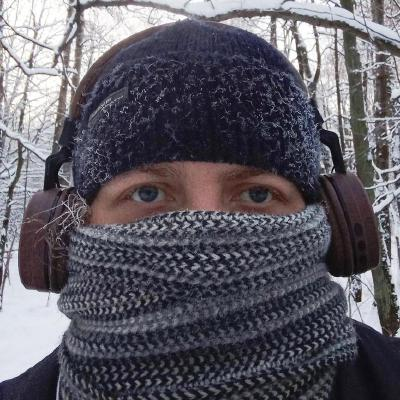
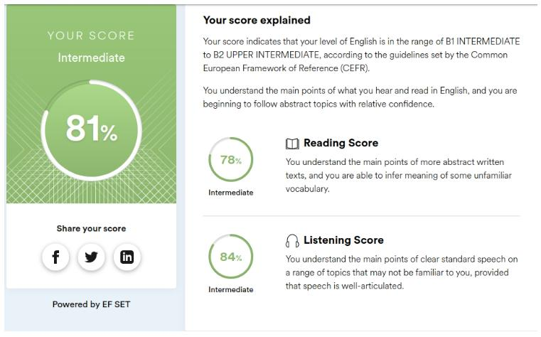

# Eugene 

 

## Contact 
   * E-mail: eugvok85@gmail.com 
   * Discord: Eugene (@Eugene-z-bazin) 

## About Me 
   * Interested in web development learning
   + Sociable
   + Time management
   + Teamwork
   + No bad habits
   + Physically active
   + Repair skills
   + Participated in volunteer activities 

## Skills: 
   * PC-user (Win/Lin)
   * MsWorld & Excel
   * HTML, CSS, JS(basics)
   * Bootstrap
   * SCSS
   * AutoCad 

## Code example: 
### Given two integers a and b, which can be positive or negative, find the sum of all the integers between and including them and return it. If the two numbers are equal return a or b. 
   ``` 
 function getSum(a, b) {
  // Определяем минимальное и максимальное значения
  let start = Math.min(a, b);
  let end = Math.max(a, b);
  
  // Создаём массив чисел от start до end включительно
  let ar = [];
  for (let i = start; i <= end; i++) {
    ar.push(i);
  }
  
  // Считаем сумму элементов массива
  return ar.reduce((acc, curr) => acc + curr, 0);
}
   ``` 

## Work Experience: 
### [ВОС](https://sergey962.github.io/Dolgodrudniy_VOS/ "society of the blind landing page") 


## Education: 
* [Web development for beginners: HTML & CSS](https://stepik.org/cert/578771 "stepic free courses") 
* [JavaScript for beginners](https://stepik.org/cert/1237986 "stepic free courses") 

## English Language:
 